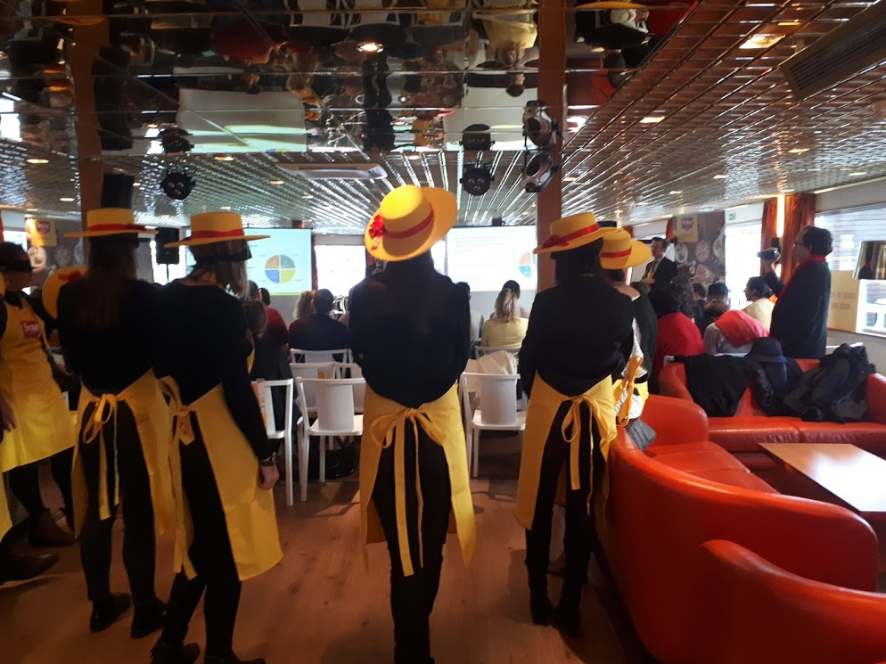
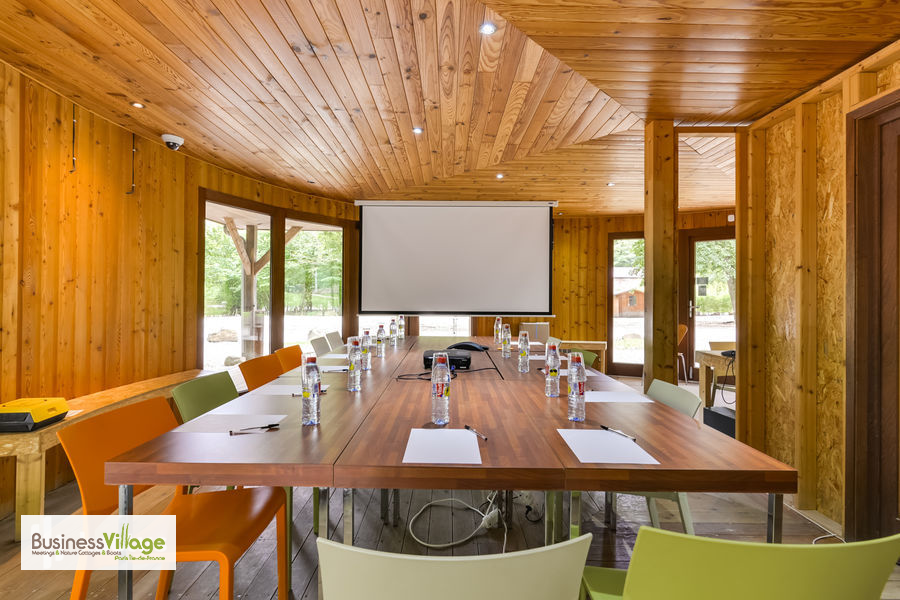
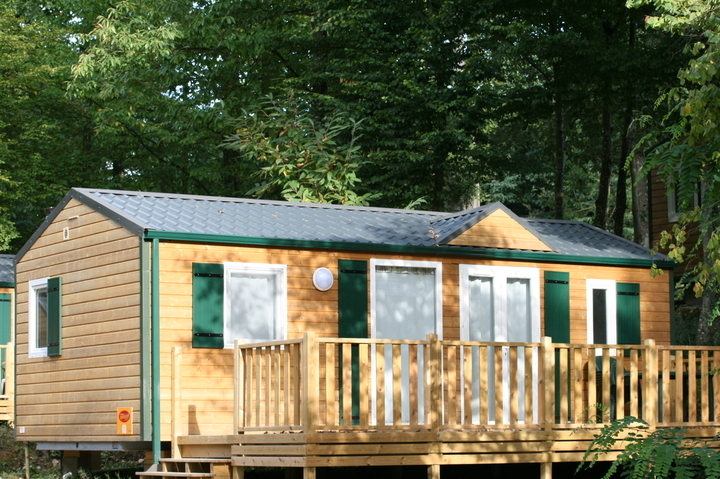
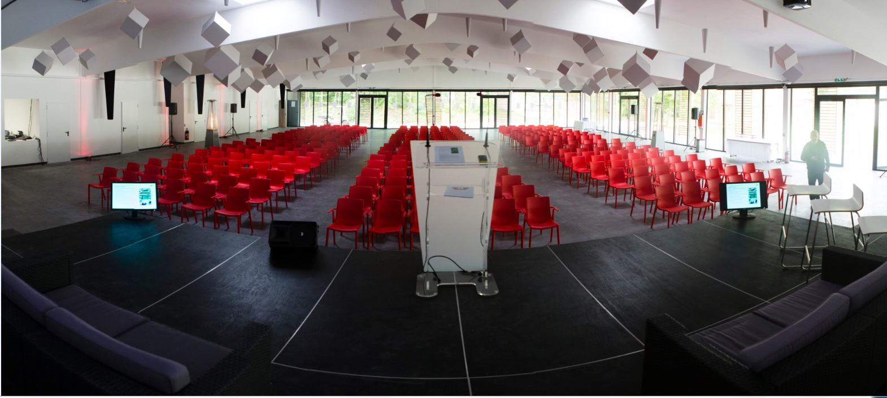
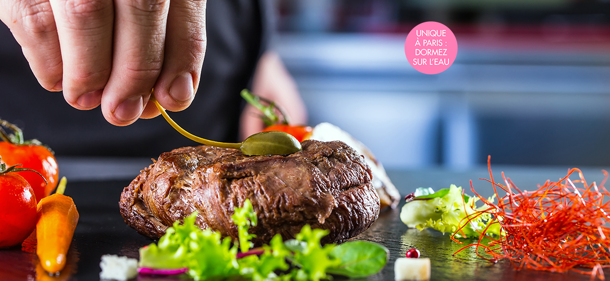
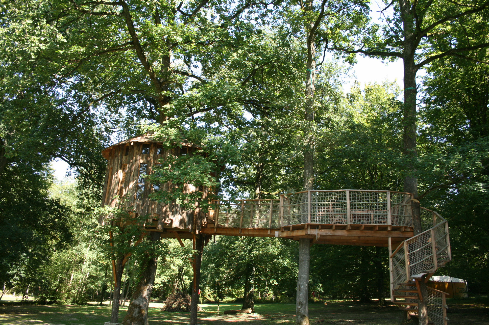
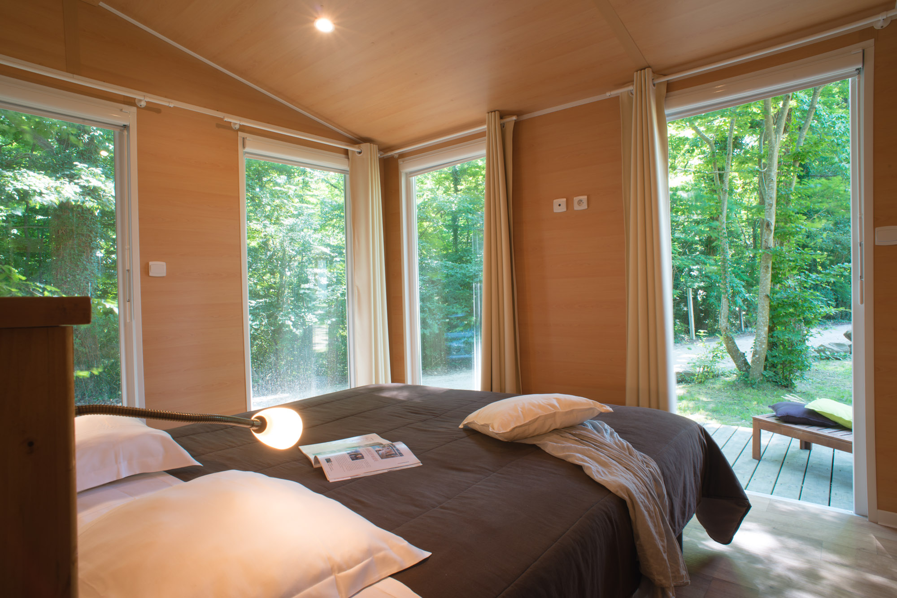

<!DOCTYPE html>
<html>
<title>BLOG DE BUSINESS VILLAGE</title>
<meta charset="UTF-8">
<meta name="viewport" content="width=device-width, initial-scale=1">
<link rel="stylesheet" href="https://www.w3schools.com/w3css/4/w3.css">
<link rel="stylesheet" href="https://fonts.googleapis.com/css?family=Montserrat">
<link rel="stylesheet" href="https://cdnjs.cloudflare.com/ajax/libs/font-awesome/4.7.0/css/font-awesome.min.css">

<body>

        <header>
            
<nav class="w3-sidebar w3-black w3-animate-top w3-xxlarge" style="display:none;padding-top:150px" id="mySidebar">
  <a href="javascript:void(0)" onclick="w3_close()" class="w3-button w3-black w3-xxlarge w3-padding w3-display-topright" style="padding:6px 24px">
    <i class="fa fa-remove"></i>
  </a>
  

    <a href="http://www.business-village.biz" class="w3-bar-item w3-button w3-text-grey w3-hover-black">A propos</a>
    <a href="http://www.business-village.biz/index.php/espaces-new-tech" class="w3-bar-item w3-button w3-text-grey w3-hover-black">Du côté de nos séminaires</a>
    <a href="https://www.facebook.com/pg/businessvillage.biz/reviews/?ref=page_internal" class="w3-bar-item w3-button w3-text-grey w3-hover-black">L'avis de nos internautes</a>
    <a href="http://www.business-village.biz/index.php/sophie-et-philippe-nos-valeurs" class="w3-bar-item w3-button w3-text-grey w3-hover-black">Contactez-nous!</a>
  

</nav>

<i class="fa fa-bars"></i> 

<header class="w3-center w3-margin-bottom">
  <h1><b>BLOG DE BUSINESS VILLAGE</b></h1>
  
<b>Du coeur dans le Business !</b>

  
<button class="w3-button w3-black" onclick="myFunction()">+/-</button>

</header>

  

    
    
    
    
    
    
  

  

    
    
    
    
    
    
	
  

  

    
    
    
    
    
    
  

<footer class="w3-container w3-padding-64 w3-light-grey w3-center w3-opacity w3-xlarge" style="margin-top:128px"> 
  <i class="fa fa-facebook-official w3-hover-opacity"></i>
  <i class="fa fa-instagram w3-hover-opacity"></i>
  <i class="fa fa-snapchat w3-hover-opacity"></i>
  <i class="fa fa-linkedin w3-hover-opacity"></i>
  
Visitez notre site internet : <a href="http://www.business-village.biz" target="_blank" class="w3-hover-text-green">Business Village</a>
	

</footer>
 

</body>
</html>

